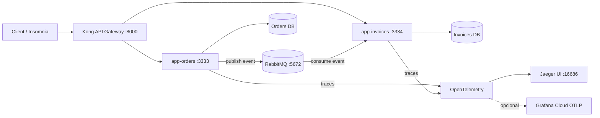

### Microsserviços Node.js (Orders + Invoices) — exemplo prático (local + AWS)

Este repositório é um **exemplo prático e evolutivo** de como estruturar uma arquitetura de **microsserviços** pensando além do código: **domínio, comunicação entre serviços, gateway, observabilidade e infraestrutura como código**.

A meta é ajudar devs que estão se aprofundando no tema (ou que precisam iniciar uma base para um case real) a verem **como as peças se conectam** com um setup que roda **localmente** e também na **AWS**.

> Observação: microsserviços têm custo operacional. Se “separa serviços” mas compartilha banco, por exemplo, costuma virar **monólito distribuído**.

---

### Visão geral (arquitetura)

- `app-orders` expõe API HTTP e **publica evento** no broker quando um pedido é criado
- `app-invoices` **consome evento** do broker e processa (ex.: criação/atualização de invoices)
- **RabbitMQ** como message broker (Pub/Sub)
- **Kong** como API Gateway (rotas e CORS)
- **Jaeger + OpenTelemetry** para tracing (e opção de exportar para **Grafana Cloud** via OTLP)
- Bancos **separados** por serviço (local via Docker; na AWS via Neon)

### Diagrama (alto nível)




### Tecnologias
- Node.js + TypeScript
- Docker / Docker Compose
- RabbitMQ (broker)
- Kong API Gateway
- OpenTelemetry + Jaeger
- Pulumi (IaC na AWS)
- Neon (Postgres serverless) na AWS
- Drizzle ORM / Drizzle Kit (migrations + studio)

---

### Requisitos
- **Node.js LTS 22.22.3**
- **Docker** instalado e rodando

Ao clonar o repositório, ele já vem com a estrutura e os `.env` necessários para o fluxo proposto.
Mesmo assim, revise as variáveis se você quiser adaptar portas, nomes e credenciais.

---

### Portas (local)
- RabbitMQ:
  - AMQP: `localhost:5672`
  - Admin: `http://localhost:15672` (user/pass: `guest` / `guest`)
- Kong:
  - Proxy (API): `http://localhost:8000`
  - Admin API: `http://localhost:8001`
  - Admin UI: `http://localhost:8002`
- Jaeger UI: `http://localhost:16686`
- Orders HTTP: `http://localhost:3333`
- Invoices HTTP: `http://localhost:3334`
- Postgres local:
  - Orders DB: `localhost:5482`
  - Invoices DB: `localhost:5483`
---
### Rodando localmente (dev)
### 1) Subir infra base (RabbitMQ, Kong e Jaeger)
Na raiz do repositório:
```bash
docker compose up -d
```
>Garanta que **RabbitMQ e Kong** estão no ar antes de iniciar os serviços.
> Se não estiverem, você pode ver erro de **socket** (normalmente relacionado ao RabbitMQ).
---
### 2) Subir o serviço Orders
```bash
cd app-orders
npm install
docker compose up -d
npx drizzle-kit migrate
npm run dev
```
> Se tudo estiver ok, você deve ver algo como:
> - `[Orders] Http Server running`

> **Dica (Drizzle Studio):** o comando `npx drizzle-kit studio` vai gerar um link para você inspecionar o banco (ver orders, criar registros de teste etc.).
---
### 3) Subir o serviço Invoices
```bash
cd ../app-invoices
npm install
docker compose up -d
npx drizzle-kit migrate
npm run dev
```
> Se tudo estiver ok, você deve ver algo como:
> - `[Invoices] Http Server running`
---
### 4) Teste ponta a ponta (Orders -> evento -> Invoices)
Com os dois serviços no ar, faça uma requisição POST.
Exemplo:
- **POST** `http://localhost:3333/orders`
- Body: `amount=2000`
Resultado esperado:
- O pedido é criado no **Orders**
- Você verá no console do **Invoices** o processamento da mensagem publicada pelo Orders (via RabbitMQ)
---
### Deploy na AWS (Pulumi)
### Pré-requisitos
- CLI do Pulumi instalada
- AWS CLI instalada
- Conta AWS configurada e autenticada na sua máquina
### Passo a passo (resumo)
1) Entre na pasta `infra`:
```bash
cd infra
```
2) Crie **2 bancos no Neon** (um por serviço):
- `orders` (uma `DATABASE_URL`)
- `invoices` (outra `DATABASE_URL`)
3) Atualize as variáveis `DATABASE_URL` no código do Pulumi:
- `infra/src/services/orders.ts` → `DATABASE_URL`
- `infra/src/services/invoices.ts` → `DATABASE_URL`
> Serão **duas URLs**, pois são **dois bancos** (um por serviço).
4) Rode as migrations nesses bancos (como no local), para criar a estrutura:
- Execute `drizzle-kit migrate` apontando para cada `DATABASE_URL` (Orders e Invoices).
5) (Opcional, recomendado) Observabilidade no Grafana Cloud:
- Crie um projeto no Grafana Cloud
- Gere as credenciais OTLP
- Preencha no Pulumi:
  - `OTEL_EXPORTER_OTLP_ENDPOINT`
  - `OTEL_EXPORTER_OTLP_HEADERS`
Ao configurar isso, a aplicação na AWS já passa a exportar traces/telemetria.
6) Deploy:
```bash
pulumi up
```
---
### Evoluindo a infra
> Além do baseline dentro de `infra/`, existe o arquivo **`evolution-infra.ts`** (na raiz do repositório) com um exemplo de como **aprimorar** o setup da AWS com Pulumi.
A ideia é servir como “próximos passos” para evoluções (mais componentes, melhorias de rede/segurança, observabilidade, escalabilidade, etc.).
---
### Aviso final
Este repositório é um **exemplo prático** de estruturação para estudar e entender como funciona uma arquitetura de **microsserviços na prática**: divisão por contexto, comunicação por mensageria, gateway, observabilidade e deploy.
Se tiver sugestões de melhoria (resiliência, idempotência, versionamento de contratos, tracing mais completo, retries, DLQ, etc.), abra uma issue ou mande um feedback.